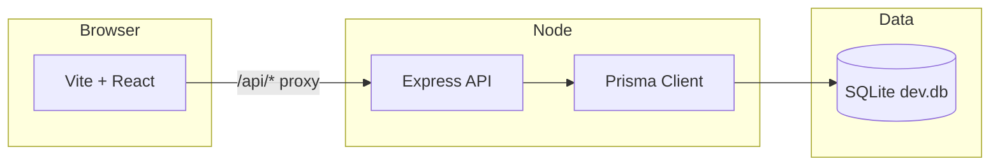

# SOC Command — Security Operations Dashboard

**SOC Command** is a full-stack web application that simulates a modern **Security Operations Center (SOC)** console. It brings together alerts, incidents, log ingestion, a lightweight detection workflow, and analyst collaboration in one place—so you can explore how SOC tooling fits together, demo ideas to teammates, or use it as a portfolio piece that goes beyond a static UI.

This is **synthetic demo data** (not a production SIEM). The goal is a believable, interactive experience: charts that move, cases you can triage, and an API you can extend toward real telemetry later.

---

## Why I built this

SOC analysts juggle dozens of tabs—queues, timelines, search, and reporting. I wanted a **single cohesive surface** that still feels like “real” enterprise software: dark glass UI, role-based access, audit trails, and CSV exports when you need to walk evidence out of the tool. If you are learning security operations or full-stack development, you can run everything locally with one command and see the full loop from **log → alert → incident → audit**.

---

## What you can do here

| Area | Highlights |
|------|------------|
| **Command dashboard** | Summary cards, Recharts analytics, activity feed, recent alerts & incidents, threat-style map, refresh and CSV export hooks tied to the API. |
| **Alerts** | Filterable queue, severities and statuses, MITRE tactic/technique fields on records, link alerts to incidents, analyst-only mutations. |
| **Incidents** | Case list, detail views, status updates, notes, assignees, and a **case timeline** narrative per incident. |
| **Log ingestion** | Upload structured log lines into SQLite via the API; they become input for the detection engine. |
| **Detection engine** | Run rules over **stored** logs to surface new alerts (training wheels for “correlation” without Elasticsearch). |
| **SOC simulator** | Generate controlled activity for demos and UI testing. |
| **Search** | Cross-entity search backed by the API (alerts, incidents, and related context). |
| **Notifications** | In-app notification center with read / mark-all-read. |
| **Audit log** | Immutable-style trail of analyst actions for accountability stories. |
| **Auth & roles** | JWT-based login, **admin / analyst / viewer** roles; analysts and admins can change operational data, viewers are read-focused. |

Some sidebar destinations (**Log search**, **Threat intelligence**, **Reports**, **Settings**) are **intentional placeholders**—they describe what you would plug in next (SIEM index, TI feeds, scheduled reports) without pretending those backends already exist.

---

## Tech stack

**Frontend**

- [React 18](https://react.dev/) + [TypeScript](https://www.typescriptlang.org/)
- [Vite 5](https://vitejs.dev/) for dev and build
- [Tailwind CSS](https://tailwindcss.com/) for layout and theming
- [Recharts](https://recharts.org/) for dashboard charts
- [React Router](https://reactrouter.com/) for routing
- [Lucide React](https://lucide.dev/) for icons

**Backend**

- [Node.js](https://nodejs.org/) + [Express](https://expressjs.com/)
- [Prisma ORM](https://www.prisma.io/) with **SQLite** by default (documented path to **PostgreSQL** if you outgrow a file DB)
- [bcryptjs](https://github.com/dcodeIO/bcrypt.js) for password hashing
- [jsonwebtoken](https://github.com/auth0/node-jsonwebtoken) for API sessions

**How they talk**

- In development, Vite **proxies** `/api` to the Express server on **port 4000**, so the browser only talks to **port 5173** and you avoid CORS friction on localhost.

---

## Architecture (high level)



---

## Quick start

You need **Node.js** and **npm**. On Windows, the repo includes helpers if system Node is missing (see below).

### 1. Install dependencies

From the **repository root**:

```bash
npm install
npm install --prefix server
```

### 2. Database (first time)

Create the schema and load demo users + SOC sample data:

```bash
npm run db:setup --prefix server
```

For more detail (reset DB, Prisma Studio, PostgreSQL), see **[SOC_DATABASE_SETUP.md](./SOC_DATABASE_SETUP.md)**.

### 3. Run the app

**Option A — one terminal (recommended)**

```bash
npm run dev:full
```

**Option B — from the `server` folder**

```bash
cd server
npm run dev:full
```

Same script: it starts **Vite** and the **API** together, with paths that behave correctly on Windows.

**Option C — Windows launcher**

- Double-click **`START DASHBOARD.bat`**, or run **`Start-Dashboard.ps1`**  
  They can install/sync dependencies, ensure the DB exists, then start the stack.

Then open **http://localhost:5173/** (or the URL Vite prints). The UI should show a healthy API indicator when **`/api/health`** succeeds.

---

## Demo login

After seeding, accounts use the **same demo password** for simplicity:

| Role | Email | Password |
|------|--------|----------|
| Analyst (good default) | `analyst@soc.local` | `socdemo2026` |
| Admin | `admin@soc.local` | `socdemo2026` |
| Viewer | `viewer@soc.local` | `socdemo2026` |

Additional seeded analysts (same password) include `j.rivera@soc.local`, `m.okonkwo@soc.local`, and others—see `server/prisma/seed.ts`.

> **Note:** Only users that exist in your **local database** can sign in. Personal email addresses are not auto-created.

---

## Default ports

| Service | Port |
|---------|------|
| Vite (UI) | `5173` |
| Express (API) | `4000` |

Override the API with `PORT` in `server/.env`. If you change it, update the Vite proxy target in `vite.config.ts` to match.

---

## Useful scripts

| Command | Where | Purpose |
|---------|--------|---------|
| `npm run dev:full` | root or `server/` | UI + API in parallel |
| `npm run dev` | root | Vite only |
| `npm run dev --prefix server` | root | API only (`tsx watch`) |
| `npm run build` | root | Production UI build → `dist/` |
| `npm run build --prefix server` | root | Compile API to `server/dist/` |
| `npm run db:setup --prefix server` | root | `db:push` + seed |
| `npm run db:studio --prefix server` | root | Prisma Studio (browse tables) |

---

## Repository layout

```
├── src/                 # React app (pages, components, auth context, API client)
├── server/
│   ├── prisma/          # schema.prisma, seed.ts, migrations workflow
│   └── src/             # Express app, controllers, services, middleware
├── scripts/             # Dev orchestration (e.g. run-dev-full.mjs)
├── SOC_DATABASE_SETUP.md
├── Start-Dashboard.ps1
└── START DASHBOARD.bat
```

---

## API surface (short)

Everything under **`/api`** except **`POST /api/auth/login`** and **`GET /api/health`** expects a **Bearer JWT** after login.

Notable groups:

- **Dashboard:** `GET /api/dashboard`, `GET /api/metrics`, `GET /api/analytics`
- **Alerts & incidents:** CRUD-style read, analyst patches, `POST /api/alerts/:id/convert`
- **Logs & detection:** `POST /api/logs/upload`, `POST /api/detection/run`
- **Simulation & ticks:** `POST /api/simulation/run`, `POST /api/tick/*` (dev-oriented)
- **Exports:** `GET /api/export/alerts`, `GET /api/export/incidents` (CSV)
- **Search, notifications, audit, users:** `GET /api/search`, notification routes, `GET /api/audit`, `GET /api/users`

A longer route table lives in **[SOC_DATABASE_SETUP.md](./SOC_DATABASE_SETUP.md)**.

---

## Production notes

- Build the UI with `npm run build`.
- Build the API with `npm run build --prefix server` and run `npm start --prefix server`.
- You will still need a reverse proxy or static file strategy to serve `dist/` with the API in production; the repo is optimized for **local development** first.

---

## Contributing & feedback

Issues and pull requests are welcome—whether you are tightening security (never ship demo passwords in a real deployment), adding tests, or wiring a real log backend into the placeholder sections.

---

## Acknowledgments

Built with the usual excellent open-source stack above. If this project helped you learn or present SOC ideas more clearly, a star on the repo is appreciated.
